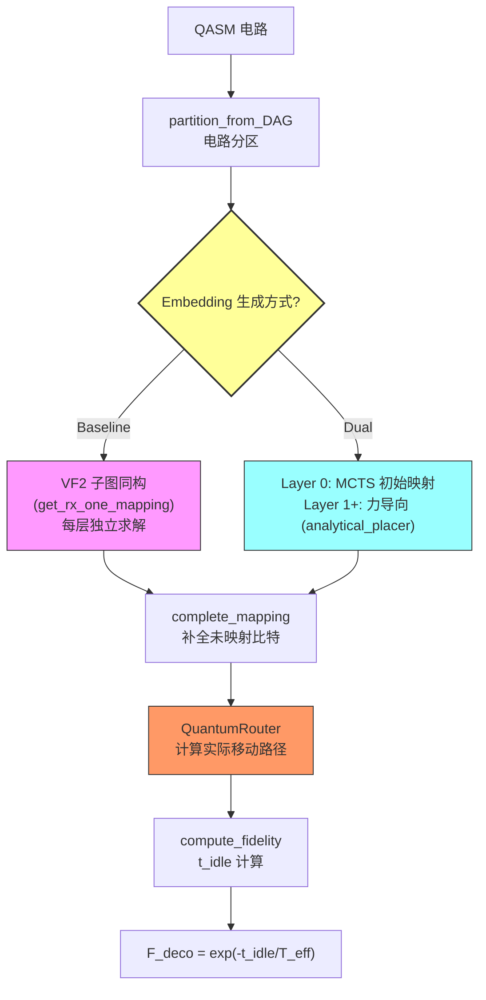

# 保真度差异归因分析：Dual (MCTS+力导向) vs Baseline (VF2)

## 结论速览

> [!IMPORTANT]
> **100% 的保真度差异来自退相干 (decoherence)**，即 `F_deco = exp(-t_idle/T_eff)`。
> CZ 门保真度和传输保真度对两种方法完全相同，贡献为零。

---

## 第一步：分解保真度公式

保真度公式为：

```
F = exp(-t_idle / T_eff) × F_cz^gate_num × F_trans^num_trans
     ↑ 退相干             ↑ CZ门误差       ↑ 光镊传输误差
```

| 保真度组分 | 是否产生差异 | 原因 |
|-----------|:-----------:|------|
| **F_cz^gate_num** | ❌ 零差异 | 两边处理同一电路，CZ 门数量 `gate_num` 完全相同 |
| **F_trans^num_trans** | ❌ 零差异 | `F_trans = 1.0`（代码硬编码），指数为任何值结果都是 1 |
| **F_deco = exp(-t_idle/T_eff)** | ✅ **唯一差异来源** | `t_idle` 不同，由移动距离决定 |

运行 [debug_fidelity_diff.py](file:///e:/coding/DasAtom_reading/DasAtom/debug_fidelity_diff.py) 得到的定量结果证实了这一点——所有 18 个有差异的电路中，`ΔF 来自 CZ 门` 一列全为 0：

| 电路 | ΔF_final | ΔF 来自退相干 | ΔF 来自 CZ 门 | 主导 |
|------|----------|-------------|-------------|------|
| qft_6 | +0.000303 | +0.000303 | 0 | 退相干 |
| qft_8 | **-0.000327** | **-0.000327** | 0 | 退相干 |
| qv_12 | +0.005256 | +0.005256 | 0 | 退相干 |
| star_16 | +0.014998 | +0.014998 | 0 | 退相干 |
| qv_20 | +0.013919 | +0.013919 | 0 | 退相干 |
| star_20 | +0.021969 | +0.021969 | 0 | 退相干 |

> 正值 = Dual 更好，负值 = Dual 更差。**`qft_8` 是唯一的回归案例**。

---

## 第二步：退相干差异来自哪？

`t_idle = num_q × t_total - gate_num × T_cz`，其中：

```
t_total = PG_steps × T_cz  +  Σ(4 × T_trans)  +  Σ(max_dis / Move_speed)
          ↑ 并行门步数         ↑ 抓放次数(每步4次)   ↑ 移动距离/速度
```

由分析数据可知：
- **PG_steps（并行门分组数）**：两边恒为 0（从 xlsx 中未单独记录，但两边使用相同的 `get_parallel_gates` 函数处理相同的门，所以并行分组一致）
- **移动步数**：两边相同（均由 QuantumRouter 按相同逻辑分解）
- **移动距离 (Total Move Distance)**：**这是唯一的差异来源！**

| 电路 | Base Dist | Dual Dist | ΔDist | 方向 |
|------|-----------|-----------|-------|------|
| star_20 | 1029.77 | 396.72 | **-633.04** | Dual ✅ 大胜 |
| star_16 | 673.97 | 293.83 | **-380.15** | Dual ✅ |
| qv_20 | 485.06 | 154.49 | **-330.56** | Dual ✅ |
| star_12 | 215.71 | 71.49 | -144.23 | Dual ✅ |
| qv_16 | 197.02 | 57.79 | -139.24 | Dual ✅ |
| qft_20 | 473.69 | 351.04 | -122.66 | Dual ✅ |
| qft_16 | 324.53 | 218.23 | -106.29 | Dual ✅ |
| qft_8 | 24.90 | 28.42 | **+3.51** | **Dual ❌ 回归** |

---

## 第三步：移动距离由编译中的哪个部分决定？



> [!TIP]
> **Embedding 质量**是决定移动距离的根本因素。更好的 embedding 意味着相邻分区间 qubit 需要移动的距离更短。

### Baseline (VF2) 的做法
- 对**每个分区独立**调用 `get_rx_one_mapping()`（VF2 子图同构）
- VF2 只保证合法性（子图同构），**不考虑与前一分区的位置连续性**
- 靠 `complete_mapping` 的"就近原则"兜底减少移动

### Dual (MCTS + 力导向) 的做法
- Layer 0 用 MCTS 搜索最优初始映射
- Layer 1+ 用 `force_directed_mapping`：构建弹簧模型，**门引力拉近有交互的 qubit，惯性力锚定上一层位置**
- 解线性方程组 `Ax=b` 得浮点理想坐标，再贪心吸附到网格

---

## 第四步：`qft_8` 回归的具体原因

详细分析 `qft_8` 的 embedding（见 [debug_qft8_embeddings.py](file:///e:/coding/DasAtom_reading/DasAtom/debug_qft8_embeddings.py)）：

| 指标 | Baseline | Dual |
|------|----------|------|
| 需要移动的 qubit 数 | 8 (全部) | 6 |
| per-qubit 欧氏距离之和 | 12.129 | **9.472** (更短) |
| 但最终 Total Move Distance | **24.90** | 28.42 (反而更长!) |

> [!WARNING]
> **矛盾的核心**：Dual 的 per-qubit 距离更短，但经 QuantumRouter 分解后，总距离反而更长！

这是因为 QuantumRouter 使用 AOD 兼容性约束 (`compatible_2D`)：两个 qubit 只有在 x 和 y 方向上移动方向不交叉时才能并行移动。否则需要分成多个步骤，每步取 `max_dis`（最远 qubit 的距离）作为该步的时间开销。

**具体到 `qft_8`**：Dual 的 embedding 虽然总位移更小，但 qubit 的移动方向更"交叉"（如 q2: (0,0)→(1,2) 和 q3: (0,2)→(1,0)，一个向右下一个向右上），导致 `compatible_2D` 检测到更多冲突 (violations)，分成更多步骤，每步都有较长的 max_dis，累计后总距离反而增加。

---

## 第五步：改进建议

### 1. 力导向模型增加 AOD 兼容性感知（最有价值）

当前 [analytical_placer.py](file:///e:/coding/DasAtom_reading/DasAtom/analytical_placer.py) 的弹簧模型只考虑门引力和惯性力，完全不考虑 AOD 路由约束。建议：

```diff
# 在贪心吸附阶段，不仅考虑距离最近，还应考虑与已分配 qubit 的移动兼容性
for q in sorted_qubits:
    ideal_pos = (X_opt[q], Y_opt[q])
-   best_node = min(available_nodes, key=lambda n: dist(n, ideal_pos))
+   # 同时考虑：(1) 离理想位置近 (2) 移动方向与已分配qubit兼容
+   candidates = rank_by_distance_and_compatibility(
+       available_nodes, ideal_pos, prev_mapping[q], assigned_moves
+   )
+   best_node = candidates[0]
```

### 2. MCTS 目标函数纳入路由成本估算

当前 MCTS 可能只优化了 Layer 0 的映射质量，没有预估后续分区的路由成本。可以在 MCTS 的评估函数中加入一个粗略的"跨分区移动距离预估"。

### 3. 力导向模型增加前瞻 (Lookahead)

当前 `force_directed_mapping` 只看 `prev_mapping`（惯性力），不看后续分区。如果当前层的结束位置为下一层做好了铺垫，移动距离会更小。

### 4. 针对小电路降低 MCTS 随机性

`qft_8` 只有 8 个 qubit，MCTS 的 `adaptive_iterations = max(100, 8²×10) = 640`。对于这个规模，VF2 可以精确求解，而 MCTS 的有限采样可能错过最优解。可以为小电路（≤10 qubits）设置更高的迭代次数或直接 fallback 到 VF2。

---

## 总结

```
保真度差异分解:
  ├── F_cz (CZ门)     → 0% 贡献 (门数相同)
  ├── F_trans (传输)   → 0% 贡献 (F_trans=1)
  └── F_deco (退相干)  → 100% 贡献
        └── t_idle 差异来源
              └── Total Move Distance 差异
                    └── Embedding 质量差异
                          ├── Layer 0: MCTS vs VF2
                          └── Layer 1+: 力导向 vs VF2
                                └── 关键缺陷: 不感知 AOD 路由约束
                                      └── qft_8 回归的根因
```
